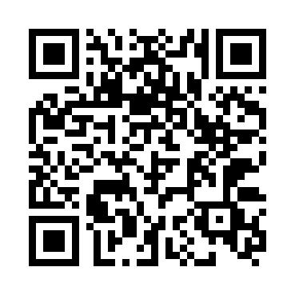
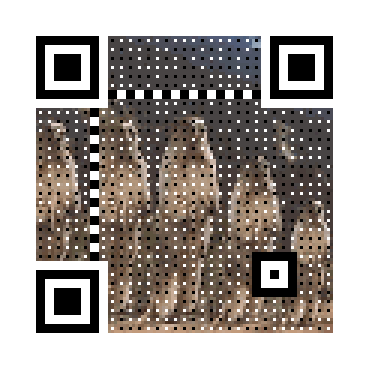

# QR-Code

## 概述

​		可生成普通二维码、带图片的艺术二维码(黑白与彩色)、动态二维码(黑白与彩色)。

​		参考[sylnsfar]( https://github.com/sylnsfar)大神的[qrcode]( https://github.com/sylnsfar/qrcode)。

## 目录

* [示例](#示例)
* [安装](#安装)
* [使用方法](#使用方法)
* [参数解析](#参数解析)
* [使用提示](#使用提示)

## 示例

* 一般二维码

  

* 彩色二维码

  

* 动图二维码

  

## 安装 

```
pip install myqr
```


## 使用方法

* 命令行参数

```python
#设置的一些参数
myqr Words

[-v{1,2,3,...,40}]
[-l{L,M,Q,H}]
[-n output - filename]
[-d output-directory]

[-p picture_file]
[-c color]
[-con contrast]
[-bri brightness]
```

* 导入库参数

```python
# help(myqr)
Positional parameter
   words: str

Optional parameters
   version: int, from 1 to 40
   level: str, just one of ('L','M','Q','H')
   picutre: str, a filename of a image
   colorized: bool
   constrast: float
   brightness: float
   save_name: str, the output filename like 'example.png'
   save_dir: str, the output directory
```


## 参数解析

```
import os
from MyQR import myqr
from PIL import Image

version, level, qr_name = myqr.run(
    Words,
    version=1,
    level='H',
    picture=None,
    colorized=False,
    contrast=1.0,
    brightness=1.0,
    save_name=None,
    save_dir=os.getcwd()
	)
```

* Words:

  输入链接或者句子，然后在当前目录产生相应二维码图片，默认名为"qrcode.png"

* version、level:

  **默认边长**是取决于输入信息长度和纠错等级；**默认纠错等级**是最高的H

  **自定义**

  `-v`控制边长，范围是**1至40**，数字越大边长越打；

  `-l`控制纠错水平，范围是L、M、Q、H,从左到右依次升高。

* picture、colorized:

  `-p`用来将QR二维码图像与一张同目录下的图片相结合，产生一张**黑白**图片。

  `-c`可以使产生的图片由**黑白**变为**彩色**

* contrast、brightness:

  `con`用以调节图片的**对比度**，默认1,0表示原始图片；

  `bri`用来调节图片的**亮度**，默认1.0表示原始图片。

* save_name、save_dir:

  **默认输出文件名**是"qrcode.png"，而**默认储存位置**是当前目录

  `-n`控制文件名，格式可以是`.jpg`,`.png`,`.bmp`,`.gif`;

  `-d`控制位置


## 使用提示

* 请采用**正方形**或近似正方形的图片
* 建议在图片尺寸大的时候使用`-v`的值也应该**适当**变大。