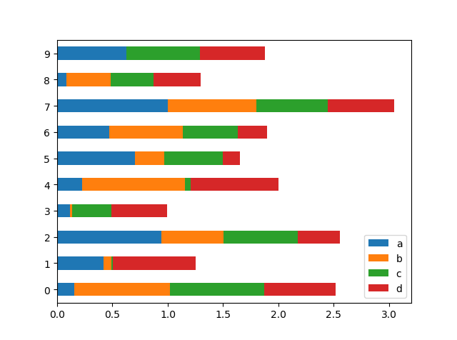

## 数据分析pandas

​		pandas(Python Data Analysis Library)是基于NumPy的数据分析模块，提供了大量标准数据模型和高效操作大型数据集所需要的工具。

​		pandas主要提供了3种数据结构：1.Series，带标签的一位数组；2.DataFrame，带标签且大小可变的二维表格结构；3.Panel，带标签且大小可变的三维数组。

```python
>>>import pandas as pd
```

### 1.生成一维数组

```python
>>>import pandas as pd
>>>import numpy as np
>>>x = pd.Series([1,3,5,np.nan])
>>>y = pd.Series([1,2,3,4],index = ['zhang','li','zhou','wang'],dtype = 'float32')
```

​		np.nan是空值（NaN），pandas中默认nan是安全的

### 2.生成二维数组

```python
>>>datas = pd.data_range(start = '20190101',end = '20191231',freq = 'D')  #间隔为天
>>>datas = pd.data_range(start = '20190101',end = '20191231',freq = 'M')

>>>df = pd.DataFrame(np.random.randn(12,4),index = dates,columns = list('ABCD'))
>>>df = pd.DataFrame([[np.random.randint(1,100) for j in range(4)] for i in range(12)],
                    index = dates,columns = list('ABCD'))

>>>df.DataFrame({'A':[np.random.randint(1,100) for i in range(4)],
                'B':pd.data_range(start = '20190101',periods = 4,freq = 'D'),
                'C':pd.Series([1,2,3,4],index = list(range(4)),dtype = 'float32'),
                'D':np.array([3]*4,dtype = 'int32'),
                'E':pd.Categorical(["test","train","test","train"]),
                'F':'foo'})
```

## 3.二维数据查看

```python
>>>df.head()       #默认显示前五行
>>>df.head(4)      #查看前三行
>>>df.tail(2)      #查看最后两行

#查看索引、列名和数据
>>>df.index
>>>df.columns
>>>df.values

#查看统计信息 平均值、标准差、最小值、最大值等信息
>>>df.describe()

#转置
>>>df.T
```

## 4.排序、选择、修改

```python
#排序
>>>df.sort_index(axis = 0,ascending = False)     #对轴进行排序
>>>df.sort_values(by = 'A')                      #对数据进行排序
>>>df.sprt_values(by = 'A',ascending = False)    #降序排列

#选择
>>>df['A']									#选择列
>>>df[0:2]									#切片选择
>>>df.loc[:,['A'.'C']]  					#选择多列
>>>df.loc[['zhang','zhou'],['A','D','E']]	#同时指定多行与多列进行选择

>>>df.at['zhang','A']						#查询指定行、列位置的数据值

>>>df.iloc[3]
>>>df.iloc[0:3,0:4]							#查询前3行、前4列数据
>>>df[df.A>50]								#按给定条件查询

#修改
>>>df.iat[0,2] = 3							#修改指定行、列位置的数据值
>>>df.loc[:,'D'] = [np.random.randint(50,60) for i in range(4)]  #修改某列值
>>>df['C'] = -df['C']						#指定列取反
```

## 5.缺失值处理

```python
>>>df1 = df,reindex(index = ['zhang','li','zhou','wang'],columns = list(df.columns)+['G'])
>>>df1.iat[0,6] = 3							#修改指定位置元素值，该列其他元素为缺失值NaN
>>>pd.isnull(df1)							#测试缺失值，缺失值为True/False阵列
>>>df1.dropna()								#返回不包含缺失值的行
>>>df1['G'].fillna(5,inplace = True)		#使用指定值填充缺失值
```

## 6.数据操作

```python
>>>df1.mean()								#平均值，忽略缺失值
>>>df.mean(1)								#横向计算平均值
>>>df1.shift(1)								#数据移位
>>>df1['D'].value_counts()					#直方图统计

>>>df2 = pd.DataFrame(np.random.randon(10,4))
>>>p1 = df2[:3]								#数据行拆分
>>>p2 = df2[3:7]							
>>>p3 = df2[7:]								

>>>df3 = pd.concat([p1,p2,p3])				#数据行合并
>>>df2 == df3								#测试两个二维数据是否相等，返回True/False

>>>df4 = df.DataFrame({'A':[np.random.randint(1,5) for i in range(8)],
                'B':[np.random.randint(10,15) for i in range(8)],
                'C':[np.random.randint(20,30) for i in range(8)],
                'D':[np.random.randint(80,100) for i in range(8)]})
>>>df4.groupby('A').sum()					#数据分组计算
>>>df4.groupby(['A','B']).mean()
```

## 7.结合matplotlib绘图

```python
import pandas as pd
import numpy as np
import matplotlib.pyplot as plt

df = pd.DataFrame(np.random.randn(1000,2),columns = ['B','C']).cumsum()
df['A'] = pd.Series(list(range(len(df))))
plt.figure()
df.plot(x = 'A')
plt.show()
```


下面绘制柱状图

```python
df = pd.DataFrame(np.random.rand(10,4),columns = ['a','b','c','d'])
df.plot(kind = 'bar') #改为 df.plot(kind = 'barh',stacked = True)
plt.show()
```




## 8.文件读写

```python
df5.to_excel('d:\test.xlsx',sheet_name = 'dfg')				#将数据保存为Excel文件
df6 = pd.read_excel('d:\test.xlsx','dfg',index_col = None,na_values = ['NA'])

df6.to_csv('d:\test.csv')									#将数据保存为csv文件
df7 = pd.read_csv('d:\test')
```


