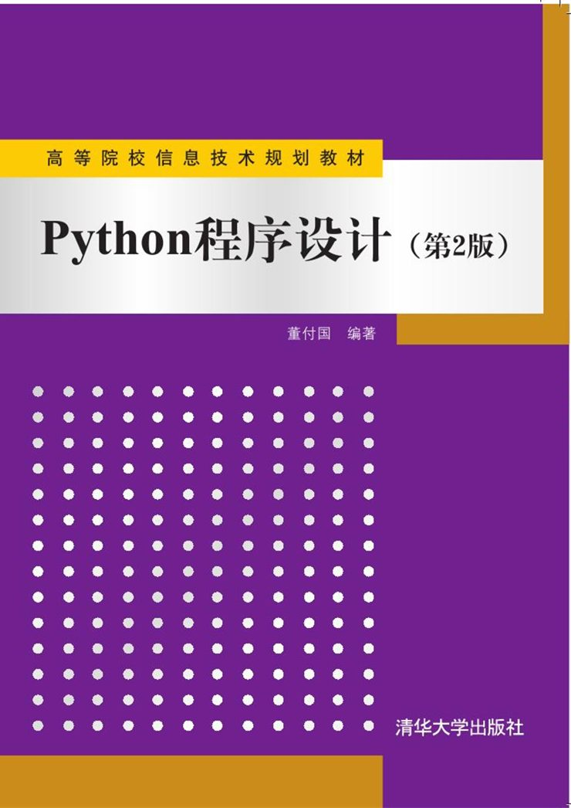

# 推荐书籍

## [Python程序设计(第2版)]( http://www.tup.tsinghua.edu.cn/bookscenter/book_06900801.html )

* 基础知识
* Python序列
* 选择与循环
* 字符串与正则表达式
* 函数设计与应用
* 面向对象程序设计
* 文件操作
* 异常处理结构与程序调试、测试
* GUI编程
* 网络程序设计
* 大数据处理
* Windows系统编程
* 多线程与多进程编程
* 数据库编程
* 多媒体编程
* 逆向工程与软件分析
* 科学计算与可视化
* 密码学编程
* 安卓平台的